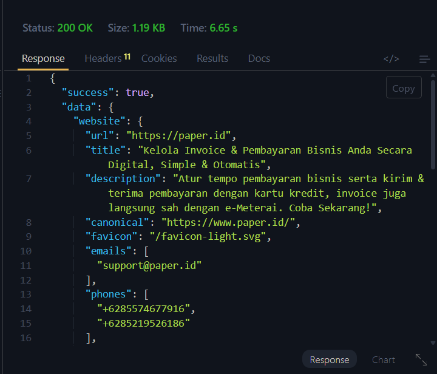

# Data Acquisition Engine

Sistem intelijen data perusahaan yang dibangun dengan **Go (Golang)** untuk mengumpulkan dan mengagregasi informasi dari tiga sumber utama — **Metadata Website**, **Informasi Domain (RDAP)**, dan **Lokasi Geografis (OpenStreetMap Nominatim)** — secara cepat dan efisien melalui pemrosesan paralel dengan goroutine.

---

## Desain & Arsitektur Software

Proyek ini menerapkan prinsip **Clean Architecture** dengan pemisahan tanggung jawab yang jelas antar lapisan:

```
data-acquisition-engine/
├── cmd/api/              # Entry point aplikasi (main.go)
├── internal/
│   ├── handler/          # HTTP Handler (Controller layer)
│   ├── service/          # Business logic & integrasi API (Service layer)
│   └── response/         # Helper standarisasi response JSON
```

- **Cmd Layer** (`cmd/api/main.go`) — Inisialisasi aplikasi, dependency injection, dan registrasi routing.
- **Handler Layer** (`internal/handler/`) — Menerima request HTTP, memvalidasi input, memanggil service, dan mengembalikan response.
- **Service Layer** (`internal/service/`) — Seluruh logika bisnis dan komunikasi dengan API eksternal.

### Optimasi Concurrency

Endpoint integrasi final `GET /company-information` dirancang untuk meminimalkan latency dengan memanfaatkan **goroutine** dan **sync.WaitGroup**:

1. **Fase Paralel Awal** — Pemanggilan `WebsiteService.Extract()` dan `DomainService.Extract()` dieksekusi secara bersamaan dalam dua goroutine terpisah. Kedua operasi ini tidak memiliki dependensi satu sama lain, sehingga dapat berjalan paralel penuh.

2. **Fase Paralel Bergantung** — Setelah hasil website tersedia, `LocationService.Find()` dijalankan secara paralel menggunakan properti `title` dari metadata website sebagai query pencarian lokasi di OpenStreetMap Nominatim.

3. **Mekanisme Fallback** — Jika pencarian lokasi menggunakan `title` website menghasilkan `null` atau error (misalnya karena title terlalu panjang atau tidak relevan), sistem secara otomatis mengekstrak nama domain sebelum ekstensi (contoh: `"paper"` dari `"paper.id"`) dan melakukan pemanggilan ulang ke LocationService dengan query tersebut.

```go
// Alur orkestrasi:
//
// ┌─────────────────┐     ┌─────────────────┐
// │ WebsiteService  │     │  DomainService  │    ← Paralel (wg.Add(2))
// └────────┬────────┘     └─────────────────┘
//          │ title
//          ▼
// ┌─────────────────┐
// │ LocationService │                           ← Setelah title tersedia
// └────────┬────────┘
//          │ (jika null/error)
//          ▼
// ┌─────────────────┐
// │  Fallback:      │
// │  extractNama()  │                           ← Retry dengan nama domain
// │  → LocationSvc  │
// └─────────────────┘
```

---

## Instalasi & Menjalankan Aplikasi

### Prasyarat

- **Go** versi 1.25 atau lebih baru
- Koneksi internet (untuk memanggil API eksternal)

### Menjalankan dengan Go

```bash
# 1. Clone repository
git clone https://github.com/Zyrexnn/data-acquisition-engine.git
cd data-acquisition-engine

# 2. Download dependencies
go mod download

# 3. Jalankan aplikasi
go run cmd/api/main.go
```

Server akan berjalan pada `http://localhost:8080`.

### Menjalankan dengan Docker

#### Prasyarat Docker

- **Docker** dan **Docker Compose** terinstal di sistem

#### Menggunakan Docker Compose (Direkomendasikan)

```bash
# 1. Clone repository
git clone https://github.com/Zyrexnn/data-acquisition-engine.git
cd data-acquisition-engine

# 2. Build dan jalankan container
docker compose up --build -d

# 3. Verifikasi container berjalan
docker ps
```

#### Menggunakan Docker langsung

```bash
# 1. Build image
docker build -t data-acquisition-engine .

# 2. Jalankan container
docker run -d -p 8080:8080 --name data-acquisition-engine data-acquisition-engine
```

Server akan berjalan pada `http://localhost:8080`.

#### Menghentikan Container

```bash
# Hentikan dan hapus container
docker compose down
```

---

## Deployment (Render)

Proyek ini sudah dideploy dan dapat diakses secara publik melalui **Render**:

- **Base URL:** `https://data-acquisition-engine.onrender.com`

Semua endpoint yang sama dengan versi lokal dapat diakses langsung melalui URL produksi di atas. Berikut contoh penggunaan endpoint utama pada environment Render:

```
# Dokumentasi Swagger UI
https://data-acquisition-engine.onrender.com/swagger/index.html

# Endpoint integrasi perusahaan
https://data-acquisition-engine.onrender.com/company-information?domain=paper.id

# Extract website metadata
POST https://data-acquisition-engine.onrender.com/extract/website

# Extract domain intelligence
POST https://data-acquisition-engine.onrender.com/extract/domain

# Find location
POST https://data-acquisition-engine.onrender.com/extract/location
```

> **Catatan:** Aplikasi di-deploy menggunakan [`render.yaml`](render.yaml) (atau Docker image yang sama dengan instruksi di atas). Free tier Render akan melakukan *spin down* saat tidak ada traffic, sehingga request pertama mungkin membutuhkan waktu *cold start* beberapa detik.

---

## Dokumentasi API Interaktif (Swagger UI)

Proyek ini dilengkapi dengan dokumentasi API interaktif menggunakan **Swagger UI** yang di-generate secara otomatis melalui anotasi komentar pada source code menggunakan library [swaggo/swag](https://github.com/swaggo/swag).

### Mengakses Swagger UI

Setelah aplikasi berjalan (baik melalui Go langsung maupun Docker), buka browser dan akses:

```
http://localhost:8080/swagger/index.html
```

Atau akses versi produksi yang sudah dideploy di Render:

```
https://data-acquisition-engine.onrender.com/swagger/index.html
```

Swagger UI menyediakan:
- Deskripsi lengkap setiap endpoint beserta parameter dan response
- Kemampuan untuk mencoba langsung setiap API (*Try it out*) dari browser
- Model schema untuk setiap request body dan response JSON
- Dokumentasi yang selalu sinkron dengan source code

### Regenerasi Dokumentasi Swagger

Jika terdapat perubahan pada anotasi komentar handler, jalankan ulang perintah berikut untuk memperbarui dokumentasi:

```bash
swag init -g cmd/api/main.go
```

Perintah ini akan me-regenerate folder `docs/` yang berisi `docs.go`, `swagger.json`, dan `swagger.yaml`.

---

## Dokumentasi Endpoint API

### Standarisasi Response

Seluruh endpoint mengembalikan response JSON dengan format konsisten:

```json
{
  "success": true,
  "data": { ... }
}
```

```json
{
  "success": false,
  "error": "pesan error"
}
```

---

### 1. Extract Website Metadata

Mengekstrak metadata dari sebuah URL website, meliputi title, deskripsi, Open Graph, email, nomor telepon, dan tautan media sosial.

- **Endpoint:** `POST /extract/website`
- **Content-Type:** `application/json`
- **Live (Render):** `POST https://data-acquisition-engine.onrender.com/extract/website`

**Request Body:**

```json
{
  "url": "https://paper.id"
}
```

**Response:**

```json
{
  "success": true,
  "data": {
    "url": "https://paper.id",
    "title": "Paper.id - Platform Invoice & Pembayaran Bisnis",
    "description": "...",
    "canonical": "https://paper.id",
    "favicon": "/favicon.ico",
    "emails": ["support@paper.id"],
    "phones": ["+6281234567890"],
    "social_media": ["https://linkedin.com/company/paperid"],
    "open_graph": {
      "title": "Paper.id",
      "description": "...",
      "image": "https://paper.id/og-image.png"
    }
  }
}
```

---

### 2. Extract Domain Intelligence

Mengambil informasi domain melalui protokol RDAP, termipu registrar, tanggal registrasi, tanggal kedaluwarsa, status, dan nameserver.

- **Endpoint:** `POST /extract/domain`
- **Content-Type:** `application/json`
- **Live (Render):** `POST https://data-acquisition-engine.onrender.com/extract/domain`

**Request Body:**

```json
{
  "domain": "paper.id"
}
```

**Response:**

```json
{
  "success": true,
  "data": {
    "domain": "paper.id",
    "registrar": "Digital Registra",
    "registered_at": "2018-03-15 00:00:00",
    "expired_at": "2026-03-15 00:00:00",
    "last_updated": "2024-06-01 00:00:00",
    "status": ["serverTransferProhibited"],
    "nameservers": ["ns1.example.com", "ns2.example.com"]
  }
}
```

---

### 3. Find Location

Mencari informasi lokasi geografis berdasarkan query teks menggunakan OpenStreetMap Nominatim.

- **Endpoint:** `POST /extract/location`
- **Content-Type:** `application/json`
- **Live (Render):** `POST https://data-acquisition-engine.onrender.com/extract/location`

**Request Body:**

```json
{
  "query": "Paper.id Jakarta"
}
```

**Response:**

```json
{
  "success": true,
  "data": {
    "display_name": "Jakarta, Indonesia",
    "latitude": "-6.2088",
    "longitude": "106.8456",
    "importance": 0.95,
    "osm_type": "relation",
    "address": {
      "city": "Jakarta",
      "country": "Indonesia"
    }
  }
}
```

---

### 4. Company Information (Integrated Endpoint)

Endpoint integrasi final yang menggabungkan ketiga service secara paralel. Menerima satu parameter query `domain` dan mengembalikan seluruh data intelijen perusahaan dalam satu response.

- **Endpoint:** `GET /company-information`
- **Method:** `GET`
- **Query Parameter:** `domain` (wajib)
- **Live (Render):** `GET https://data-acquisition-engine.onrender.com/company-information?domain=paper.id`

**Request:**

```
GET /company-information?domain=paper.id
```

**Response (contoh hasil nyata dari deployment Render `https://data-acquisition-engine.onrender.com/company-information?domain=paper.id`):**

```json
{
  "success": true,
  "data": {
    "website": {
      "url": "https://paper.id",
      "title": "Kelola Invoice & Pembayaran Bisnis Anda Secara Digital, Simple & Otomatis",
      "description": "Atur tempo pembayaran bisnis serta kirim & terima pembayaran dengan kartu kredit, invoice juga langsung sah dengan e-Meterai. Coba Sekarang!",
      "canonical": "https://www.paper.id/",
      "favicon": "/favicon-light.svg",
      "emails": ["support@paper.id"],
      "phones": ["+6285574677916", "+6285219526186"],
      "social_media": [
        "https://www.instagram.com/paperindonesia",
        "https://www.facebook.com/paperindonesia",
        "https://x.com/paper_indonesia"
      ],
      "open_graph": {
        "title": "Kelola Invoice & Pembayaran Bisnis Anda Secara Digital, Simple & Otomatis",
        "description": "Atur tempo pembayaran bisnis serta kirim & terima pembayaran dengan kartu kredit, invoice juga langsung sah dengan e-Meterai. Coba Sekarang!",
        "image": "https://www.paper.id/assets/images/seo/og-paper.webp"
      }
    },
    "domain": {
      "domain": "paper.id",
      "registrar": "PT Jagat Informasi Solusi",
      "registered_at": "2014-08-15 11:00:45",
      "expired_at": "2030-08-15 23:59:59",
      "last_updated": "2025-09-29 01:03:31",
      "status": ["active"],
      "nameservers": ["jeremy.ns.cloudflare.com", "magali.ns.cloudflare.com"]
    },
    "location": null
  }
}
```

> **Catatan:** Field `location` bernilai `null` ketika layanan Nominatim tidak menemukan hasil (sesuai mekanisme partial-failure pada tabel Error Handling di atas). Contoh output mentah tersimpan di [`dokumentasi/company-information-output.json`](dokumentasi/company-information-output.json).

**Tangkapan layar hasil response:**



**Error Handling:**

| Kondisi | HTTP Status | Response |
|---------|-------------|----------|
| Parameter `domain` kosong | `400 Bad Request` | `{"success": false, "error": "domain query param is required"}` |
| Seluruh service gagal | `500 Internal Server Error` | `{"success": false, "error": "all services failed to return data"}` |
| Sebagian service gagal | `200 OK` | Field yang gagal bernilai `null` pada response |

---


